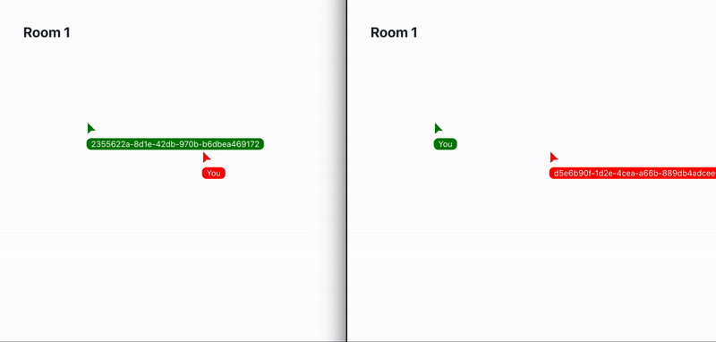

# GO Websockets With Live Cursors

Smooth live cursors implementation using `gorilla` websockets

Modified chat tutorial from `https://github.com/gorilla/websocket`

## Technical Details

- On user join, spawn a thread handling the user's `ws` connection, assinging uuid to user/connection
- On frontend cursor move, send a message containing updated cursor locations
- Spawn a thread with a timer to broadcast message containing all cursor locations every ~20 ms
- On the frontend use spring animation to smooth cursors

### Running

#### Frontend

1. `cd frontend`
2. `npm install`
3. `npm start`

#### Backend

1. `go run .`
